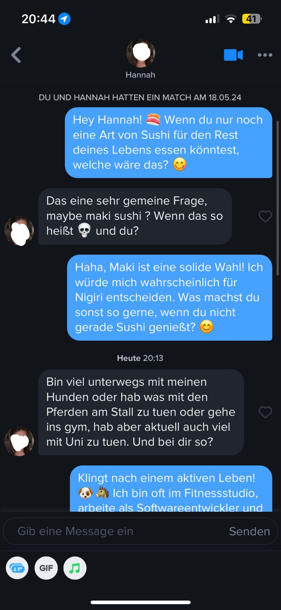
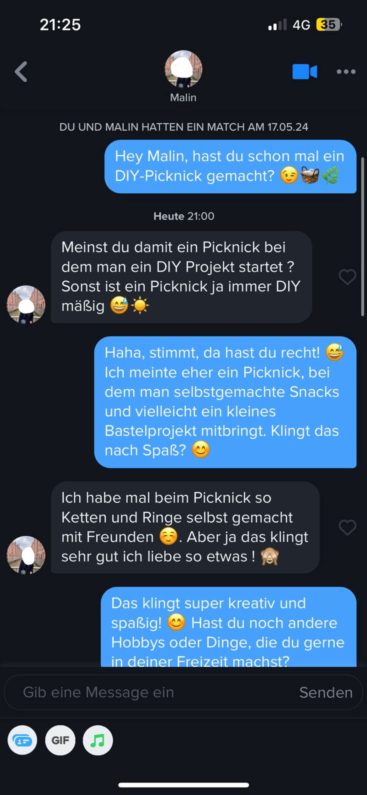

# TinderGPT – LLM-Powered Conversation Bot

> **⚠️ DISCLAIMER: EDUCATIONAL PURPOSES ONLY**  
> This project is created solely for educational and research purposes.  
> Using automated tools on dating platforms may violate their Terms of Service.  
> The authors are not responsible for any misuse. Use at your own risk and make sure you comply with all applicable terms and conditions.  
>
> C’mon guys… only jerks use this for real. This is just to show how easy it is to automate Tinder.
> Takeaway? Don’t mess with a dating platform that spits out its endpoints with zero automation detection.
> 
> PS: To all the creeps tempted to use this..you’re basically installing a backdoor after using the tool for more than 72h… just kidding… or am I?
---

## Demo

### Screenshots(old) 
*This is before the implementation of the adaptive message style. Notice the constant questions and usage of emojis.*  
<div align="center">
  
  
</div>


### Screenshots (new)
*I didn't do screenshots the last times starting up the bot. I will make a screenshot on the next run.* 
 
---

## Features

### LLM-Powered Conversations
- **GPT-4 Integration**: Uses OpenAI's AI models for context-aware responses
- **Dynamic Style Adaptation**: Automatically adapts to match's communication style
- **Multi-Phase Strategy**: Icebreaker → Interest Building → Compatibility → Date Planning
- **Adaptiv Timing**: Mimics human response patterns with adapting delays 

### Chat Management
- **Chat Exclusion**: Exclude specific chats from bot interaction
- **Chat Inclusion**: Re-include previously excluded chats
- **Persistent Storage**: Maintains conversation history across restarts
- **Real-time Monitoring**: Live tracking of active conversations
- **Debug Mode**: Detailed logging for development and troubleshooting

### Adaptiv Response 
- **Relationship Intent Detection**: Adapts strategy based on match's relationship goals
- **Defensive Information**: shares personal details only when directly asked
- **Message Length Adaptation**: Adjusts response length based on conversation phase
- **Question Frequency Control**: Balances questions and statements based on the match
  
### Configuration 
- **Flexible Configuration**: Easy setup via JSON configuration file
- **Multiple Information Levels**: Different detail levels for different conversation phases
- **Customizable Personality**: Define bot personality and conversation goals
- **Strategy Templates**: Pre-defined strategies for different relationship types

### Web Interface (Experimental)
- **Dashboard**: Visual monitoring of bot status and performance
- **Chat Management**: View and manage active conversations
- **Configuration Editor**: Web-based configuration management
- **Statistics**: Track match success rates and conversation metrics
- **Live Updates**: Real-time updates of bot activity

---

## Configuration

### Prerequisites
- Python 3.8 or higher
- Chrome browser (for token extraction)
- OpenAI API key
- Tinder account
  
### Step 1: Setup API Keys

**OpenAI API Key:**
1. Go to [platform.openai.com](https://platform.openai.com)
2. Create an account or log in
3. Go to "API Keys" → "Create new secret key"
4. Copy the key (starts with `sk-`)

**Tinder Auth Token:**
1. Open [tinder.com](https://tinder.com) in Chrome
2. Log into your Tinder account
3. Press `F12` → go to "Network" tab
4. Seach for `core`
5. Look for requests to `api.gotinder.com`
6. Click on a request → "Headers" → look for `X-Auth-Token`
7. Copy the token value

### Step 2: Fill Configuration File

All configuration is stored in `src/config/config.json`. You need to:

* Add your **OpenAI API key** and **Tinder Auth Token**
* Enter your **personal information** (name, occupation, interests, etc.)
* Define your **bot personality and strategies** for different match types
* Configure different **information levels** (minimal, basic, extended, full)
* Set up **defensive information** for when directly asked
* Configure **relationship intent prompts** for different match types

---

## Running the Application

### Start the Application

```bash
# Start the deployment script
python deployment/deployment.py
```

**What happens:**
1. The deployment script will start
2. A CLI interface will appear
3. Select "start_bot" from the menu
4. The bot will initialize and begin monitoring

### Alternative: Direct Bot Start (Not Recommended)

```bash
# Start bot directly (bypasses deployment script)
python main.py

# Start bot in debug mode
python main.py --debug
```

---


## Known Limitations

*  **Web dashboard** is not functional yet → CLI usage is recommended
*  **Tinder Auth Token** expires roughly every **48 hours** → needs to be renewed frequently
*  **Database override**: If the bot is started without valid Tinder access, the local database of existing chats may be overwritten
